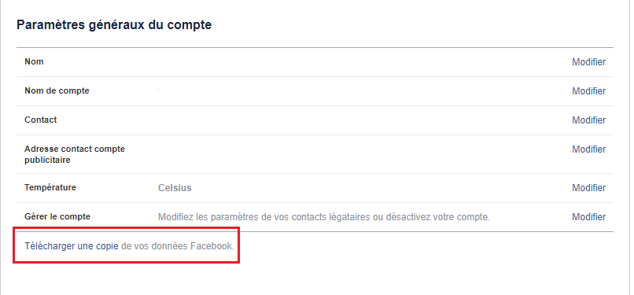

# fb_msg
Simple script to get the number of messages sent and received

Tested on Windows and Linux with Python 2 and 3 <br>
Grab a copy of your Facebook data on [Facebook settings](https://facebook.com/settings) <br>



### Usage
```
usage : fb_msg.py [file]
 -a [dir]       all stats
 -c [dir]       messages count
 -m [file]      message info
 -e [file]      event info
 ```

### Examples

Parse all `html` files in messages directory then get the number of sent and received msgs
```
python fb_msg.py -c ..\..\..\Desktop\facebook_data\messages\
Total messages : 3
Total messages : 5
Total messages : 6
Total messages : 7
Total messages : 10
[...]
Total messages : 4664
Total messages : 227818
Total messages : 227818
```

Parse only one file (= 1 conversation)
```
$ python fb_msg.py -m /messages/117.html
Cool convo
found 56 messages in 'Cool convo'
```

### Contact 
Twitter : [matteyeux](https://twitter.com/matteyeux)
